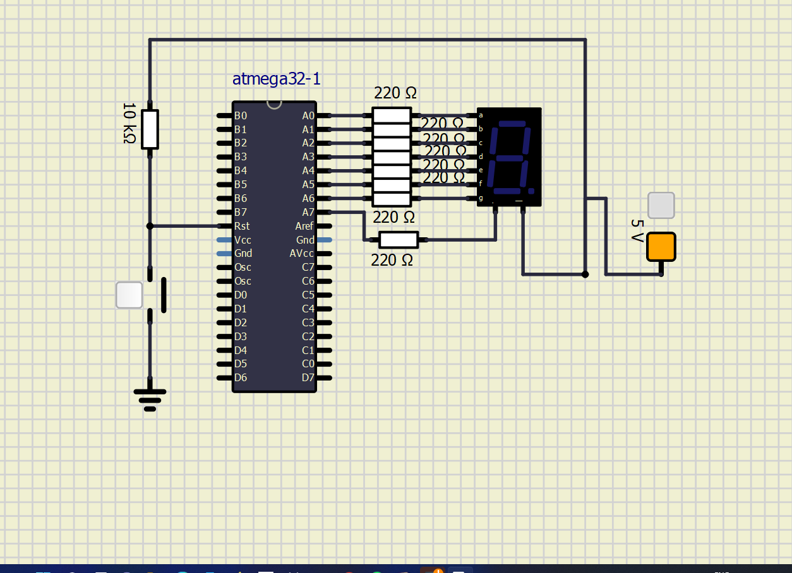
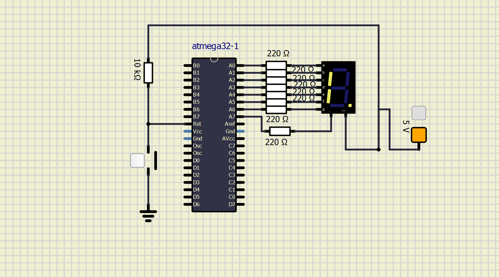

# M2_seven-segment-interfacing-with-AVR-ATMEGA32

#Folder Structure :
| Folder_Name |	Description |
| --- | ----- |
| 1_Reuriments |	Documents detailing requirements and research |
| 2_Design |	Documents specifying design |
| 3_Implemenation	| All codes and Documentation |
| 4_Testplan |	Documents with test plans |
| 5_Report |	Documentation of whole project |
| 6_Images |	All the images of this project |

## Learning Platforms
* Youtube
* future skills
* geeks for geeks

| OFF | ON |
| --- | --- |
|  |  |

